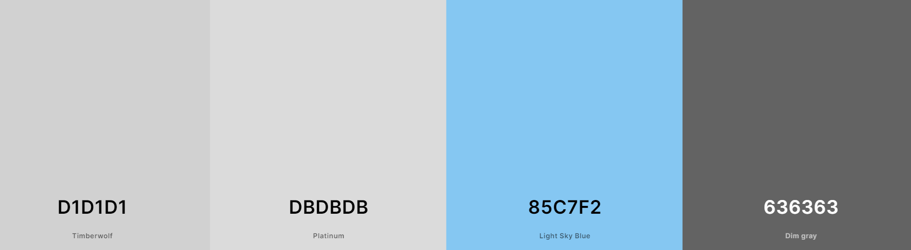

# Perfect Fit

## Overview

Puzzle Fit is a home for puzzle enthusiasts, here users can browse many kinds of puzzles and even create a puzzle using a favourite photo. 

Users can also participate in a puzzle exchange with other users wherein they can trade puzzles they are no longer using - this service is free to the users however they will pay for postage themselves, the site is more so a hosting platform for this service. 

## Contents

* [User Experience](#user-experience)
* [Design](#design)
    - [Wireframes](#wireframes)
    - [Site Styling](site-styling)
    - [Database Design](#database-design)
- Features
- Languages and Technologies
    - Languages and Frameworks
    - Packages
    - Tools and Programs Used
- Testing
    - Code Validation
    - Manual Testing
- Deployment
- Content
- Credits

## User Experience

### User Goals

#### First Time User
- As a first time user of Perfect Fit I want to be able to easily use the site across a wide range of devices. 
- As a first time user I want to be able to easily navigate the site to access the content that is available to me. 
- As a first time user I would like to be able to search for products easily.
- As a first time user I would like to filter products by categories
- As a first time user I would like to be able to create an account for the site so that I may access further features. 
- As a first time user I would like to easily be able to log in to my account. 

#### Authenticated User
- As an authenticated user I would like to be able to view my profile page. 
- As an authenticated user I would like to use the puzzle exchange to view puzzles people have uploaded. 
- As an authenticated user I would like to submit my own puzzles to the puzzle exchange
- As an authenticated user I would like to be able to message other users who I wish to exchange puzzles with. 
- As an authenticated user I would like to submit reviews on products I have purchased. 
- As an authenticated user I would like to be able to view my order history. 

#### Site Admin 

- As a site admin I would like to be able to add, edit or delete products to the store using a dedicted site owner only front end page. 
- As a site admin I would like to approve any submitted user reviews. 

## Design

### Wireframes

#### Desktop

Home

Products

Product Detail

Puzzle Exchange

Bag

Checkout

Order Confirmation

FAQ

Conctact Us

About Us

Sign Up

Log In

Log Out

Profile Page

#### Mobile

Home

Products

Product Detail

Puzzle Exchange

Bag

Checkout

Order Confirmation

FAQ

About Us

Contact Us

Sign Up

Login

Logout

Profile Page

### Site Styling

#### Colour Scheme

For this project I decided to go with the above colour scheme, as this is an e-commerce site that a user would be spending a lot of time on I wanted to keep the colour scheme as minimal as possible. Another reasoning for this choice is that there will be a lot of colour in the product images and therefore I did not want the the overall site to be too busy with colour. 

This scheme is subtle enough but still has a nice pop of colour with the hue of blue chosen. 

#### Typography

##### Logo Font

For the logo of the site I wanted go with something slightly playful that would suit the nature of the site, for this I chose Peralta

##### General Font

For the overall content of the site I wanted something easy to read that would go well alongside my chosen font for the logo, for this I chose Cutive Mono

### Database Design

#### ERD - Entity Relationship Diagram

### Models

#### Category Model

This model will be used to organise all of the puzzles into various categories, so that the user can have a more refined search. 

#### Product Model

This model will contain all of the products for the site, this model is connected to the category model through the category field. There is also a ratings field which will link this model to to the Reviews model. 

#### Reviews Model

The reviews model will be used to store a user's rating and review of the a product. If a user deletes their account, their review and rating should also be deleted. 

#### Order Model

This model will store all of the order information for a user's order, orders will be linked to a user's profile an as such this model is connected to the UserProfile model. 

#### OrderItems Model

This model will be used when adding items to the bag object, each individual item added to the bag will be tracked here and the total of the bag, as items are added or removed it will update appropriately. 

#### UserProfile Model

The UserProfile will allow for a more customised approach on Django's built in User model, allowing for linking a user to their order history and also their reviews. It is linked to the Django User model for authentication purposes. 

#### ExchangePuzzle Model

This model will be used to store user submitted puzzles which they wish to exchange with other users. 

#### Message Model 

The Message model will be used to allow users to message each other in regards to the puzzle exchange so that they can arrange postage of the items. 

#### Newsletter Model

The Newsletter model will be used as blog post where site admins can add posts with updates for the overall site and also to announce any in person meetups for puzzle exchange or competitions. 

## Agile Development

### Initial Set Up

The purpose of this Epic to help organise and create a structure for setting up the project. Beginning with creating the repository to deploying the first version of the application on Heroku

### UX Design

This Epic was used to track the planning of the over all site design, which involved creating the wireframes, colour schemes and font choices. 

### User Experience

The purpose of this Epic was to focus on one of the central parts of the overall application, which is the user. All of the stories included within this epic were central to how a user should experience the site and what would create the best experience for them. 

### User Authentication

The purpose of this Epic was the setting up authentication checks throughout the application, to ensure that user's can create accounts, sign in and log out but also would have access to different features than a guest user when logged in. 

### Stripe Payment

This Epic was used to keep track of setting up Stripe as a payment processor for the site, it also focussed on testing Stripe implementation, it tied in with Authentication through order confirmation emails. 

### Documentation

This Epic was designed to keep track of what needed to be done for the README. 

### MoSCoW

### Kanban

## Features

## Languages and Technologies

### Languages and Frameworks

### Packages

### Tools and Programs Used. 

## Testing

### Code Validation

### Manual Testing

## Bugs

## Deployment

### Site Content

#### Images

## Future Features

## Credits
