# Perfect Fit

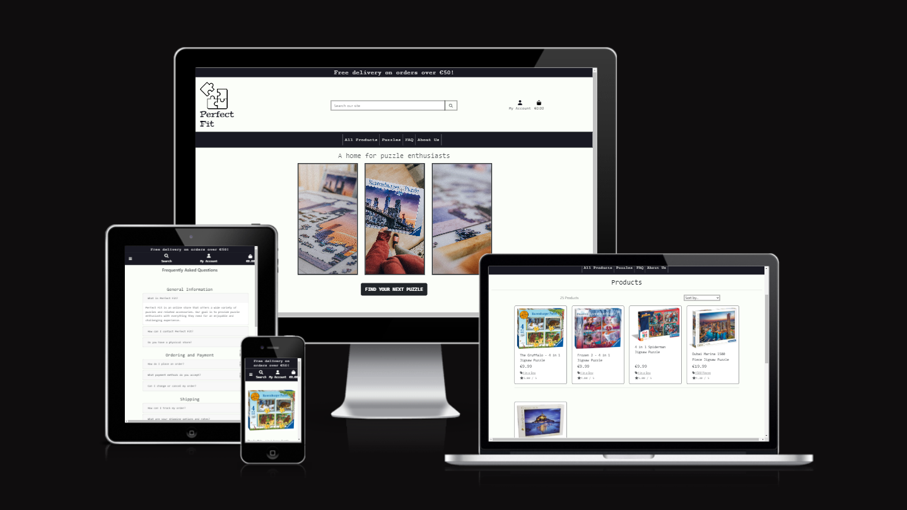

## Overview

Puzzle Fit is a home for puzzle enthusiasts, here users can browse many kinds of puzzles and even create a puzzle using a favourite photo. 

Users can also participate in a puzzle exchange with other users wherein they can trade puzzles they are no longer using - this service is free to the users however they will pay for postage themselves, the site is more so a hosting platform for this service. 

Deployed Site - [Perfect Fit](https://perfect-fit-141e9a7db2b0.herokuapp.com/)

## Contents

* [User Experience](#user-experience)
* [Design](#design)
    - [Wireframes](#wireframes)
    - [Site Styling](site-styling)
    - [Database Design](#database-design)
* [Agile Development](#agile-development)
- [Features](#features)
- [Languages and Technologies](#languages-and-technologies)
    - [Languages and Frameworks](#languages-and-frameworks)
    - [Packages](#packages)
    - [Tools and Programs Used](#tools-and-programs-used)
- [Testing](#testing)
    - [Code Validation](#code-validation)
    - [Manual Testing](#manual-testing)
- [Setting up Django App](#setting-up-django-app)
- [Deployment](#deployment)
- [Content](#content)
- [Credits](#credits)

## User Experience

### User Goals

#### First Time User
- As a first time user of Perfect Fit I want to be able to easily use the site across a wide range of devices. 
- As a first time user I want to be able to easily navigate the site to access the content that is available to me. 
- As a first time user I would like to be able to search for products easily.
- As a first time user I would like to filter products by categories
- As a first time user I would like to be able to create an account for the site so that I may access further features. 
- As a first time user I would like to easily be able to log in to my account. 


#### Authenticated User
- As an authenticated user I would like to be able to view my profile page. 
- As an authenticated user I would like to use the puzzle exchange to view puzzles people have uploaded. 
- As an authenticated user I would like to submit my own puzzles to the puzzle exchange
- As an authenticated user I would like to be able to message other users who I wish to exchange puzzles with. 
- As an authenticated user I would like to submit reviews on products I have purchased. 
- As an authenticated user I would like to be able to view my order history. 

#### Site Admin 

- As a site admin I would like to be able to add, edit or delete products to the store using a dedicted site owner only front end page. 
- As a site admin I would like to approve any submitted user reviews. 

## Design

### Wireframes

#### Desktop

<details><summary>Home</summary>

</details>

<details><summary>Products</summary>

</details>

<details><summary>Product Detail</summary>

</details>

<details><summary>Puzzle Exchange</summary>

</details>

<details><summary>Bag</summary>
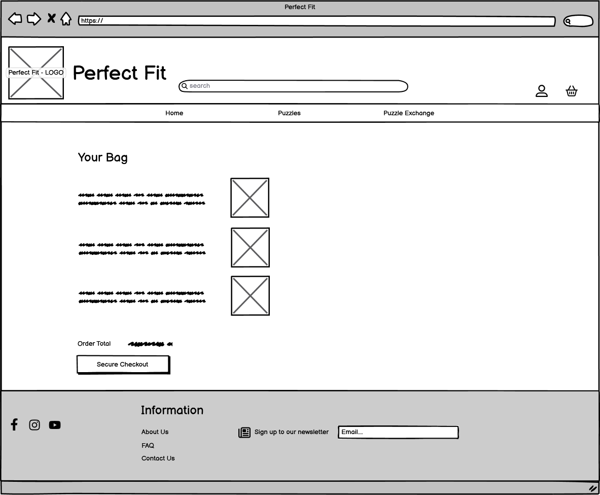
</details>

<details><summary>Checkout</summary>
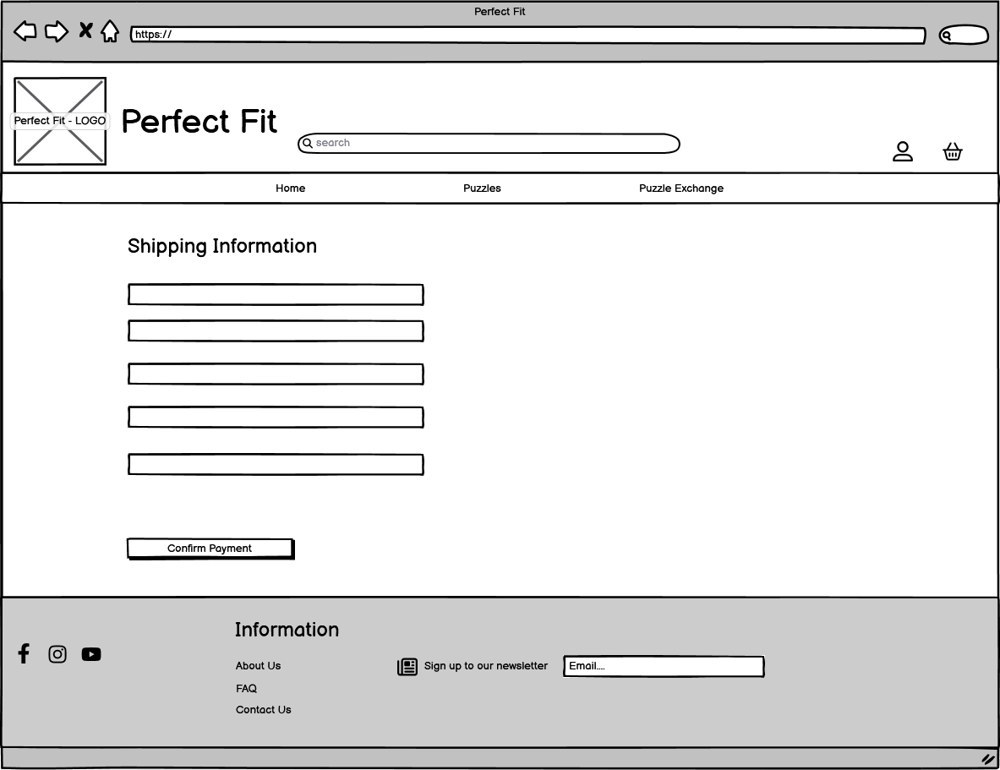
</details>

<details><summary>Order Confirmation</summary>

</details>

<details><summary>FAQ</summary>
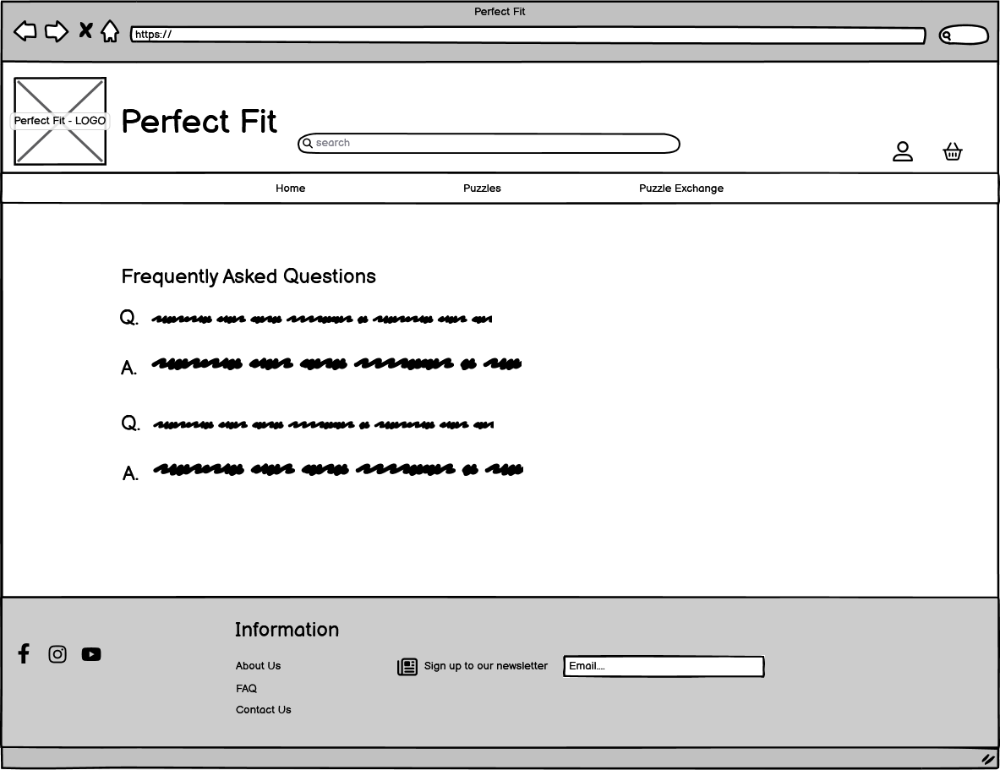
</details>

<details><summary>Conctact Us</summary>

</details>

<details><summary>About Us</summary>

</details>

<details><summary>Sign Up</summary>

</details>

<details><summary>Log In</summary>

</details>

<details><summary>Log Out</summary>

</details>

<details><summary>Profile Page</summary>

</details>

#### Mobile

<details><summary>Home</summary>

</details>

<details><summary>Products</summary>

</details>

<details><summary>Product Detail</summary>

</details>

<details><summary>Puzzle Exchange</summary>

</details>

<details><summary>Bag</summary>

</details>

<details><summary>Checkout</summary>

</details>

<details><summary>Order Confirmation</summary>

</details>

<details><summary>FAQ</summary>

</details>

<details><summary>About Us</summary>

</details>

<details><summary>Contact Us</summary>

</details>

<details><summary>Sign Up</summary>

</details>

<details><summary>Login</summary>

</details>

<details><summary>Logout</summary>

</details>

<details><summary>Profile Page</summary>

</details>

### Site Styling

#### Colour Scheme

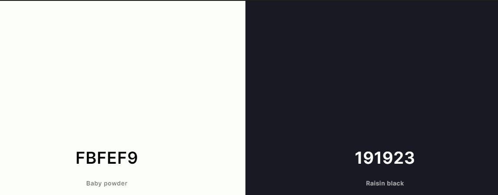

For this project I decided to go with the above colour scheme, as this is an e-commerce site that a user would be spending a lot of time on I wanted to keep the colour scheme as minimal as possible. Another reasoning for this choice is that there will be a lot of colour in the product images and therefore I did not want the the overall site to be too busy with colour. 
 

#### Typography

##### Logo Font


For the logo of the site I wanted go with something slightly playful that would suit the nature of the site, for this I chose Peralta

##### General Font

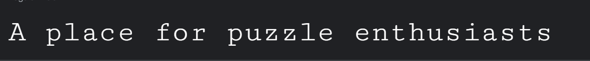

For the overall content of the site I wanted something easy to read that would go well alongside my chosen font for the logo, for this I chose Cutive Mono

### Database Design

#### ERD - Entity Relationship Diagram


### Models

#### Category Model

This model will be used to organise all of the puzzles into various categories, so that the user can have a more refined search. 

#### Product Model

This model will contain all of the products for the site, this model is connected to the category model through the category field. There is also a ratings field which will link this model to to the Reviews model. 

#### Reviews Model

The reviews model will be used to store a user's rating and review of the a product. If a user deletes their account, their review and rating should also be deleted. 

#### Order Model

This model will store all of the order information for a user's order, orders will be linked to a user's profile an as such this model is connected to the UserProfile model. 

#### OrderItems Model

This model will be used when adding items to the bag object, each individual item added to the bag will be tracked here and the total of the bag, as items are added or removed it will update appropriately. 

#### UserProfile Model

The UserProfile will allow for a more customised approach on Django's built in User model, allowing for linking a user to their order history and also their reviews. It is linked to the Django User model for authentication purposes. 

#### ExchangePuzzle Model

This model will be used to store user submitted puzzles which they wish to exchange with other users. 

#### Message Model 

The Message model will be used to allow users to message each other in regards to the puzzle exchange so that they can arrange postage of the items. 

#### Newsletter Model

The Newsletter model will be used as blog post where site admins can add posts with updates for the overall site and also to announce any in person meetups for puzzle exchange or competitions. 

During the development the Newsletter was removed and a Contact Us model was instead created, in future implentations I would like to add a check for users when signing up and on the user profile to sign up for a newsletter

#### Contact Us Model

During development a Contact Us model was created in order to allow users to reach out to Perfect Fit with any queries. 

## Agile Development

[Perfect Fit Project Board](https://github.com/users/ZoeMacf/projects/5)

This project was created using Agile methodology, this allowed for me to plan out what I wanted my application to do and how the user may wish to use it.  

To easily group my User Stories into a more structured format I created six Epics:

### Initial Set Up

The purpose of this Epic to help organise and create a structure for setting up the project. Beginning with creating the repository to deploying the first version of the application on Heroku

### UX Design

This Epic was used to track the planning of the over all site design, which involved creating the wireframes, colour schemes and font choices. 

### User Experience

The purpose of this Epic was to focus on one of the central parts of the overall application, which is the user. All of the stories included within this epic were central to how a user should experience the site and what would create the best experience for them. 

### User Authentication

The purpose of this Epic was the setting up authentication checks throughout the application, to ensure that user's can create accounts, sign in and log out but also would have access to different features than a guest user when logged in. 

### Stripe Payment

This Epic was used to keep track of setting up Stripe as a payment processor for the site, it also focussed on testing Stripe implementation, it tied in with Authentication through order confirmation emails. 

### Documentation

This Epic was designed to keep track of what needed to be done for the README. 

### MoSCoW

For this project the MoSCoW technique, (Must have, Should have, Could have, Won't have) was used for planning User Stories, it allowed me to prioritise what was essential to get the project working and ensure the best user experience. 

It also allowed me to note what could be done/added in future implementations. 

### Kanban

To help visualise the project and plan accordingly with a schedule I used the Kanban system, which was implemented through GitHub Projects. 

Through the use of the board I was able to create categories of 'To Do' , 'In Progress' and 'Done'. With this I was able to see what was needed in the more essential parts of the project. 

I also implemented 'Bugs' and 'Fixed' categories to keep track of any bugs which occurred in development and note when they had been fixed. 

## Features

### Navbar

The navbar was created using Bootstrap in order to ensure responsiveness across multiple viewports. For this project Bootstrap 4 was used due to various jQuery functions used, I had initially begun development with Bootstrap 5 but was unable to get Toast Notifications to work.

When a user is not signed in the navbar will display the following:

- All Products
- Puzzles
- FAQ
- About Us

When the user is signed in the following is instead displayed:

- All Products
- Puzzles
- Puzzle Exchange
- FAQ
- About Us

#### Navbar Signed out


#### Navbar Signed In


### Products Page

From here all of the products can be viewed as a paginated list with five items per page, the user can also choose to sort by low to high price, low to high rating or even alphabetically. 

There is also a scroll to top feature at the bottom of the page.

Authenticated Super Users are able to edit and remove products from the database through an edit/delete link below the product image.

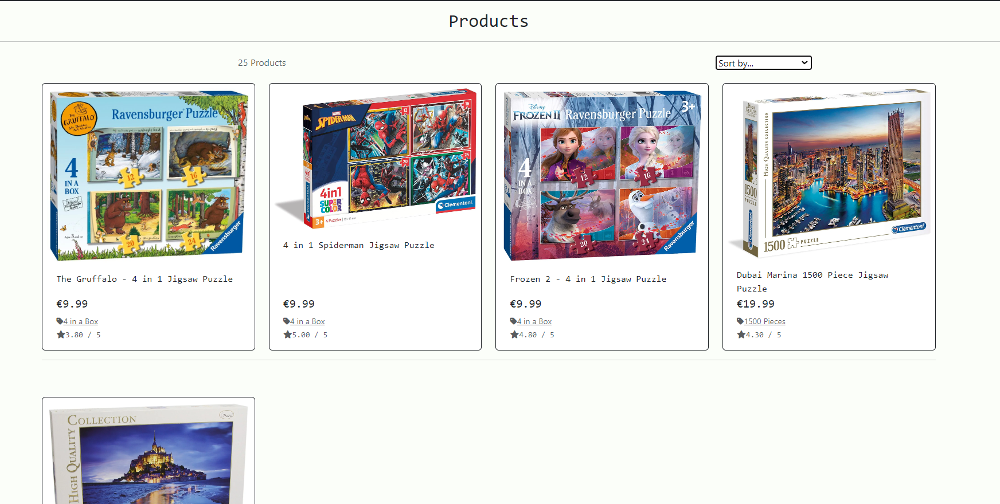

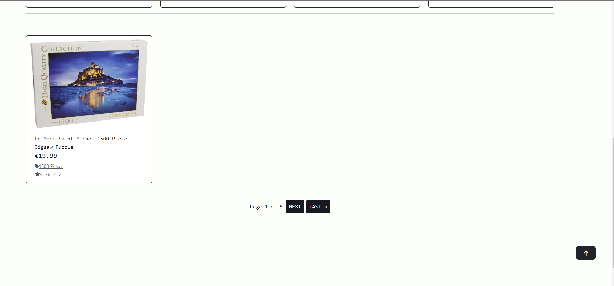

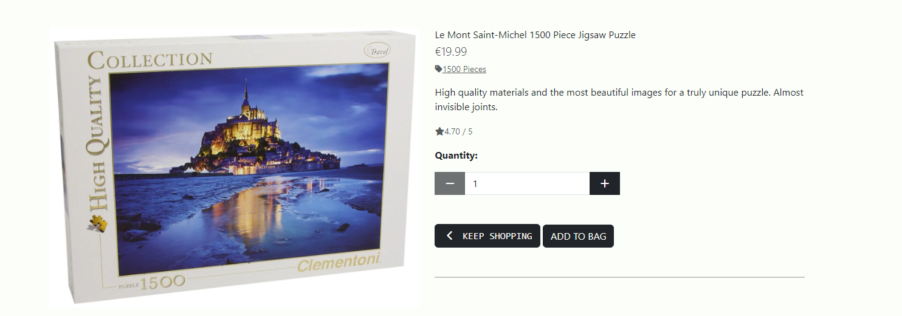


### Product Details Page

On this page the user is shown the product image, title and description. The user can also select a quantity of the item and add it to their bag, there is also an option to go back to the all products page. 

If a user is logged in there is an option to leave a review of the item. If the user is not logged in they can only see the reviews. 

#### Logged Out Product Details - Non reviewd item

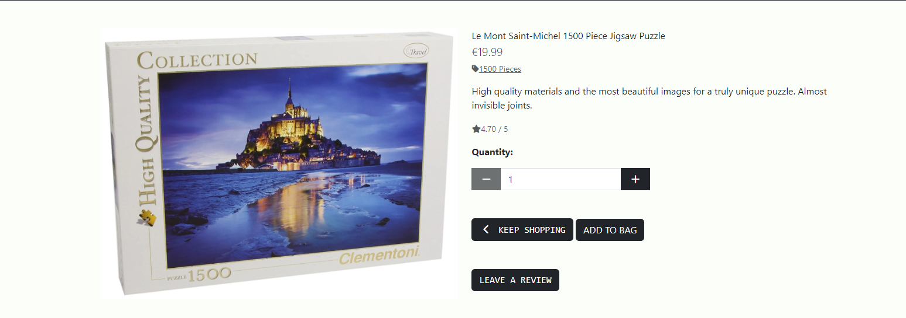

#### Logged In Product Details - Non reviewd item


#### Product Details - Reviewed Item

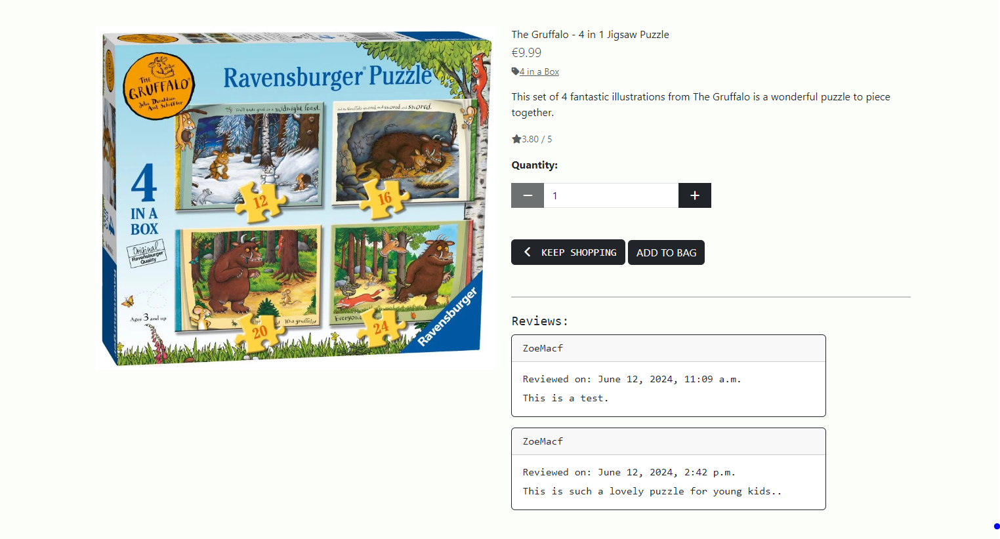

### Shopping Bag Page

On this page the user can see the contents of their shopping bag. This includes the name, price and quantity of the product. 

From here they can also adjust their bag through quantity selectors and an update/delete buttons.

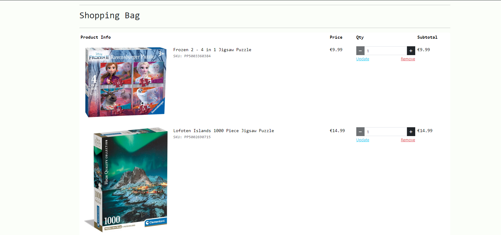
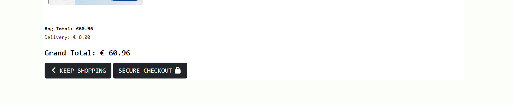

### Checkout Page

This page is for the user to enter all of the delivery and payment information before preceding with the order. There is another summary of the bag here but it cannot be edited, the user must go back to the shopping bag page. 

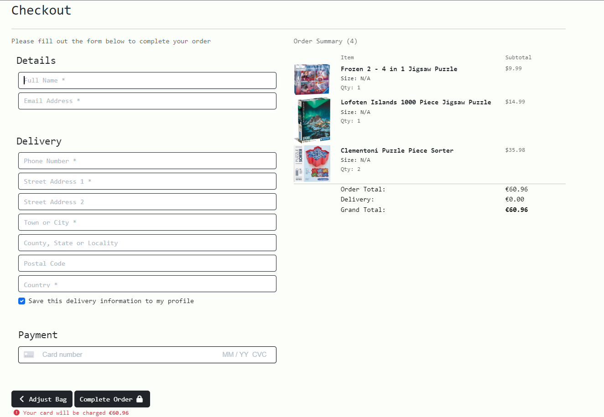

### Checkout Success Page

On a successful completion of the order this page will be displayed, summarising the order and advising the user a confirmation email has been sent. 

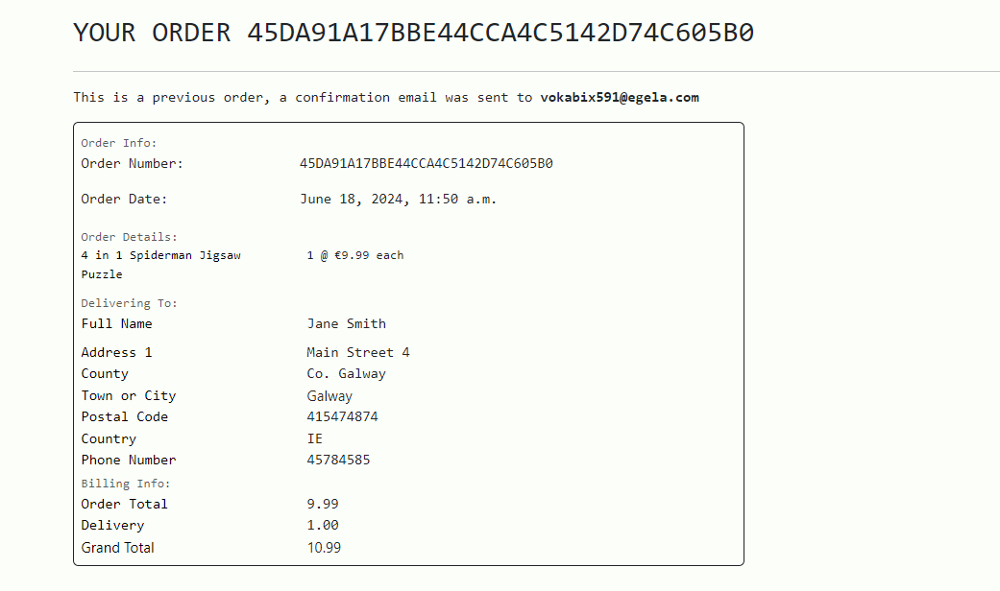

### User Profile Page

Here a user can edit their delivery information, view their order history and a quicker navigation to the Puzzle Exchange.

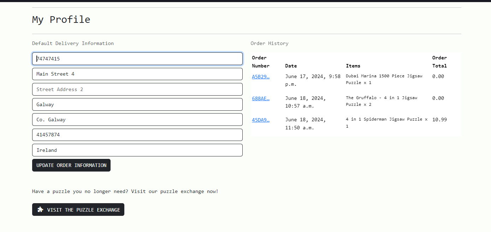

### Order History Detail 

Once the user has chosen a previous order to view they are directed to this page which summarises the order. 

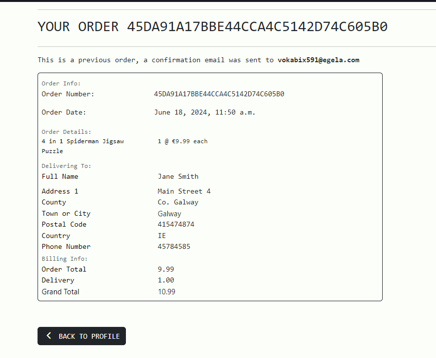

### Notifications Page

By accessing this page through the 'My Account' drop down the user is able to see if they have received any responses to their posts in the Puzzle Exchange

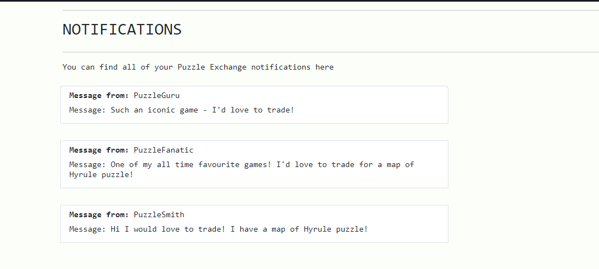

### Puzzle Exchange List

On this page the user can see a paginated list of all of the submitted puzzles for the exchange. By clicking on the title of the puzzle they are brought to a more detailed page. 

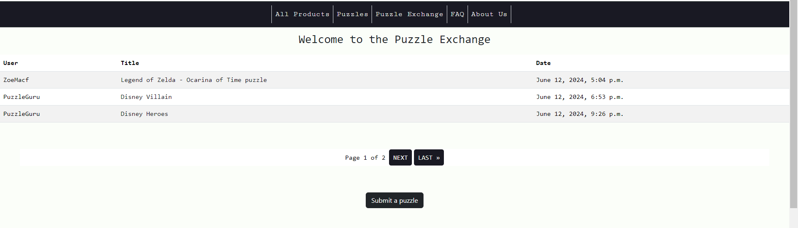

### Puzzle Exchange Puzzle Detail

From here a user can see more detail on a puzzle and if they wish to trade, they can send a message. 

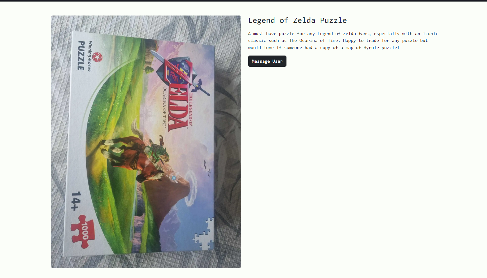

### Puzzle Exchange Submit a Puzzle

On this page a user can fill out a form to submit their own puzzle to the Puzzle Exchange.

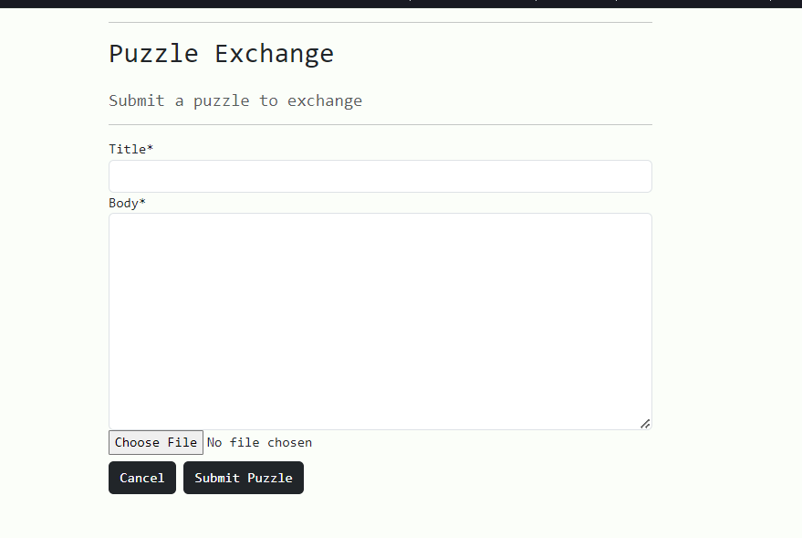

### Send Message

If the user has chosen to send a message to the owner of the puzzle they will be directed to this form. 

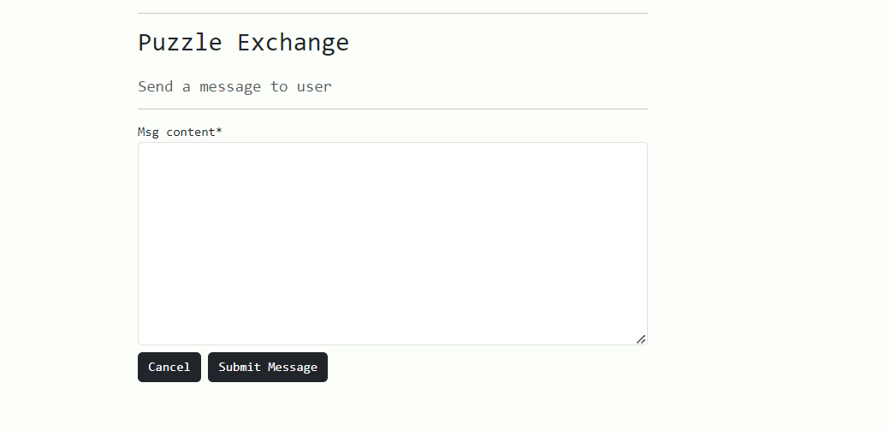

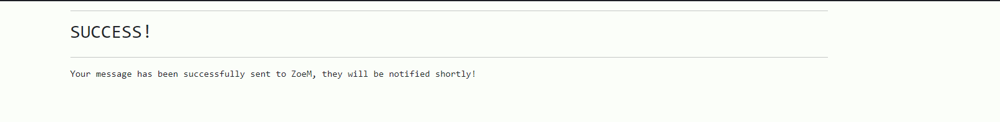

### FAQ Page

On this page the user can view all of the commonly asked questions about Perfect Fit and the service they provide.

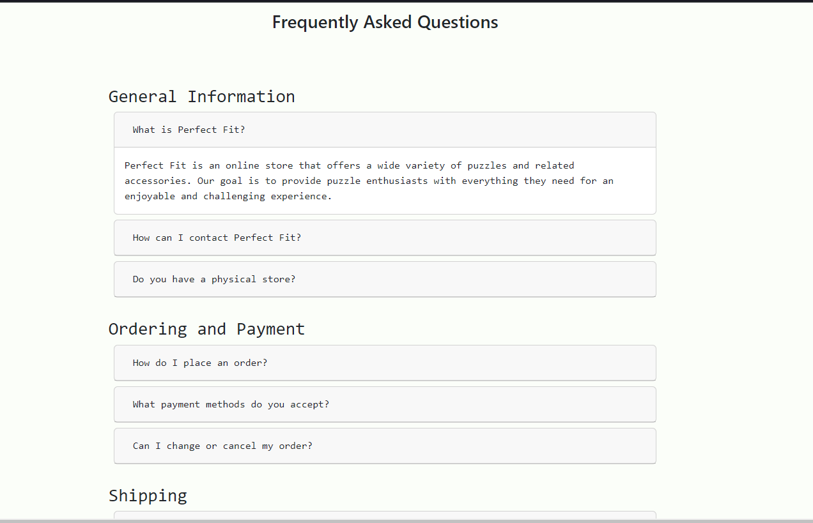

### About Us Page

On this page the user can learn more about Perfect Fit

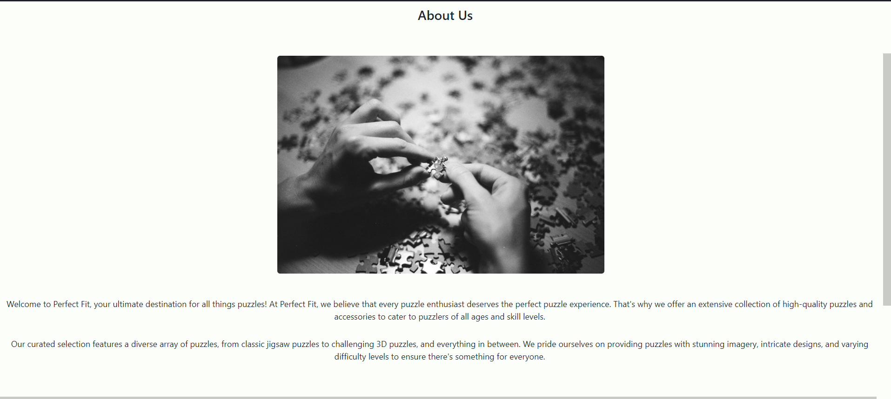

### Contact Us

From here the user can submit a query to Perfect Fit's support team. 

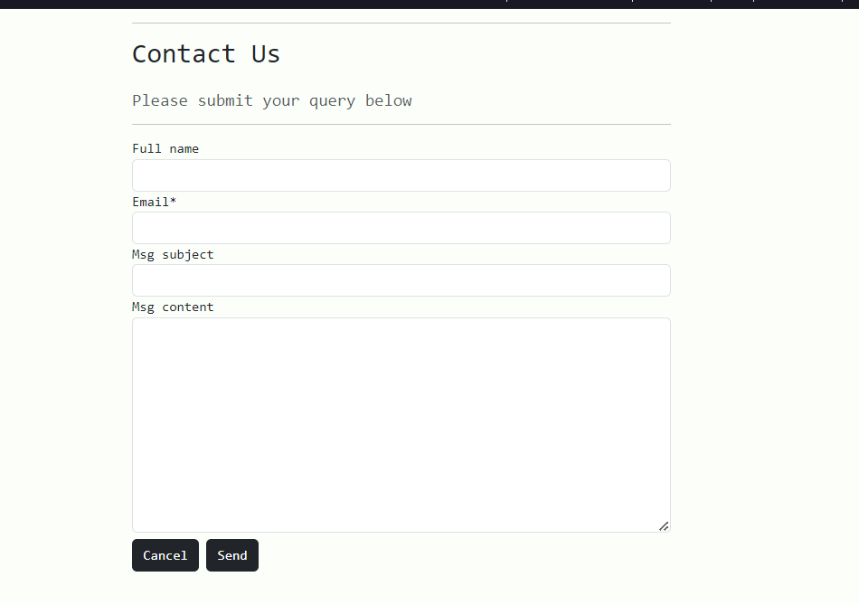

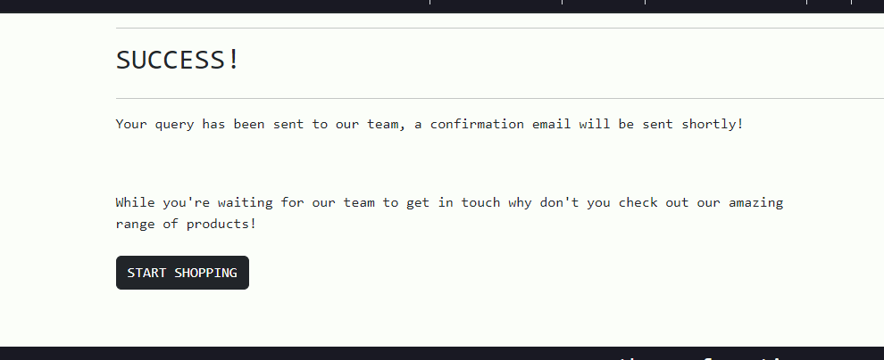


## Languages and Technologies

### Languages and Frameworks

### Packages

The following packages were installed throughout the development. 

| Package Name| Package Description |
| ----------- | ----------- |
| [Django-allAuth](https://docs.allauth.org/en/latest/)   | This package was used to provide templates, views and models necessary for user authentication.    |        |
| [Django-crispy-forms](https://django-crispy-forms.readthedocs.io/en/latest/)   | Crispy Forms was used for more customisable forms and more user friendly.   |        |
| [Whitenoise](https://pypi.org/project/whitenoise/)   | Whitenoise was used to allow the app to serve it's own static files which would be needed for deployment.        |
| [Cloudinary](https://console.cloudinary.com/console/c-76474938bafa5565ebd5ea8f26db45/home/product-explorer)   | Cloudinary was used for hosting product images online for deployment.        |
| [Pillow](https://pypi.org/project/pillow/)   | Pillow was used for image processing.        |
| [Stripe](https://dashboard.stripe.com/test/developers)   | Stripe was used for implementing a safe and secure means of taking payments and using webhooks to send confirmation emails.         |
| [Black](https://pypi.org/project/black/)   | Black was used to format all of the .py files to Pep8 standard before a final check with a Pep8 Linter. |

### Tools and Programs Used

- [GitPod](https://gitpod.io/workspaces) was used as the main IDE for the project. 
- [Git](https://git-scm.com/) was used for version control. 
- [GitHub](https://github.com/) for hosting my repository and project board. 
- [Heroku](https://id.heroku.com/login) was used for deployment. 
- [Coolors](https://coolors.co/) was used for the colour palette.
- [AmIResponsive](https://ui.dev/amiresponsive) for creating the README header image. 
- [FontAwesome](https://fontawesome.com/) for providing all icons used throughout the site.  
- [Balsamiq](https://balsamiq.com/) for creating the 
wireframes. 
- [Code Institute Pep8 Linter](https://pep8ci.herokuapp.com/#) was used for reviewing all .py files during code validation tests. 

## Testing

### Code Validation

#### Lighthouse

All of the pages for this project were tested using [Google-Lighthouse](https://developer.chrome.com/docs/lighthouse/overview/).

##### Home Page

##### Products Page

##### Products Details Page

##### Bag Page

##### Checkout Page

##### Checkout Success Page

##### About Us Page

##### FAQ Page

##### Puzzle Exchange Page

##### Puzzle Exchange Submission Page

##### Puzzle Exchange User's Submissions

##### User Profile Page

##### Add Product Page

##### Edit Product Page

##### Sign Up Page

##### Log In Page

##### Log Out Page

### JavaScript Validation

#### HTML Validation

HTML markup was validated using [W3C-HTML](https://validator.w3.org/nu/)

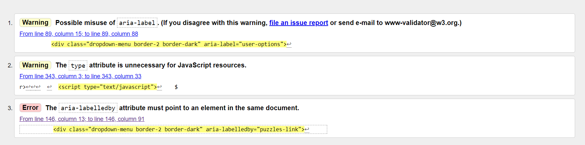

All of the html used throughout the site passed bar these three issues, the warning regarding possible misuse of the aria-label was orginally an error regarding labelledby but when I looked into a fix for the issue the solution was to change it to aria-label.

The error regarding aria-labelled by was fixed but is still showing, I reviewed the code and was unable to find it. 

#### CSS Validation

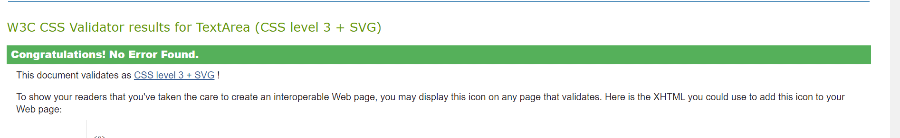


### Python Validation

All of the .py files were formatted using Black and then checked with a Pep8 linter, all of the files passed this check - however the settings.py had long lines for the password authentication section and I was unable to remedy this issue. 

### Manual Testing

### Navigation

| Feature Tested  | Outcome  | Test Performed  | Result  | Pass/Fail  |
|---|---|---|---|---|
|  All Products - 500 Pieces Link  | Display all products in the category '500 Pieces' | Click on 'All Products' dropdown and select '500 Pieces' link.  | Products page is displayed and filtered to only show puzzles that match category.  | Pass  |
|  All Products - 1000 Pieces Link  | Display all products in the category '1000 Pieces' | Click on 'All Products' dropdown and select '1000 Pieces' link.  | Products page is displayed and filtered to only show puzzles that match category.  | Pass  |
|  All Products - 1500 Pieces Link  | Display all products in the category '1500 Pieces' | Click on 'All Products' dropdown and select '1500 Pieces' link.  | Products page is displayed and filtered to only show puzzles that match category.  | Pass  |
|  All Products - Wooden Jigsaw Puzzles Link  | Display all products in the category 'Wooden Jigsaw Puzzles' | Click on 'All Products' dropdown and select 'Wooden Jigsaw Puzzles' link.  | Products page is displayed and filtered to only show puzzles that match category.  | Pass  |
|  All Products - 4 in a Box Link  | Display all products in the category '4 in a Box'  | Click on 'All Products' dropdown and select '4 in a Box'  | Products page is displayed and filtered to only show puzzles that match category.  | Pass |
|  All Products - Accessories Link  | Display all products in the category 'Accessories'   | Click on 'All Products' dropdown and select 'Accessories'  | Products page is displayed and filtered to only show puzzles that match category.  | Pass |
|  Puzzle Exchange - All Submissions Link |Direct logged in users to a page showing all of the puzzles that have been submitted to the Puzzle Exchange | Once logged in click on the 'Puzzle Exchange' dropdown and select 'All Submissions' | All Submissions page is displayed showing a table of puzzle submissions.  | Pass |
|  Puzzle Exchange - My Submissions Link |    |   |   |  |
|  FAQ Link | Directs the user to a page with a list of Frequently Asked Questions   | Click on the FAQ link on navbar | FAQ page is displayed with list of questions.  | Pass |
|  About Us Link | Directs user to a page with more information about Perfect Fit   | Click on the About Us link on the navbar  | About Us page is displayed with further information on Perfect Fit  | Pass  |

### Products

| Feature Tested  | Outcome  | Test Performed  | Result  | Pass/Fail  |
|---|---|---|---|---|
|  All Products - Pagination  | Only 5 products must be displayed at a time, button to click next page should be visible and previous if next has been clicked. | View the All Products page and confirm only 5 products are visible max, test pagination buttons.  | Products page is displayed with a max of 5 products and the respective buttons appear for page navigation  | Pass  |
|  All Products - Sorting  | Products can be sorted by price, rating and alphabetical order | View the All Products page using the selector filter the products  by each category.  | Products are filtered into ascending and descending order for price, rating and alphabetical order  | Pass  |
|  Product Detail - Add to bag  | Once on a product page it can be added to the basket and a notification is displayed to advise it was successful | Select a product from the all products page and click the 'Add to Bag' button.  | Product is successfully added to the bag and a notification displays advising that it has been added along with the product details.  | Pass  |
|  Product Detail - Select Quantity  | Once on a product page the quantity can be selected using the plus and minus buttons | Select a product from the all products page and choose a quantity before adding to the basket.  | The correct quantity of the product is added to the bag and a notification displays advising that it has been added, quantiy is also displayed.  | Pass  |
|  Product Detail - Leave a Review  | Once on a product page click the 'Add Review' button so submit a review. | When the button is clicked the user should be directed to a separate page with a form to submit the review. | After clicking the 'Leave a Review' button a page with a form is displayed, on completion of the review it is then displayed on the product page. | Pass  |
|  Product Detail - Return to all Products  | Go back to the products page from product detail page | Once on a product page click the 'Keep Shopping' button to go back to the products page. | After clicking the button the all products view is displayed | Pass  |

### Shopping Bag

| Feature Tested  | Outcome  | Test Performed  | Result  | Pass/Fail  |
|---|---|---|---|---|
|  Shopping Bag - Display products  | View all bag contents |  Navigate to the shopping bag page to view all contents of bag.| All of the products in the bag are visible on the Shopping Bag page, product name, image and quantity.  | Pass  |
|  Shopping Bag - Update bag  | Update the contents and quantity of the shopping bag. |  On the shopping bag page, the bag can be updated through changing the quantity or removing an item| Using the selectors beside each product, reduce the quantity of one item and delete another.  | Pass  |
|  Shopping Bag - View Totals  | The bag total, delivery and grand total should be visible | When on the shopping bag page, navigate to the bottom of the bag and review the bag total, delivery and grand total| The correct amounts for bag total, delivery and grand total are displayed.  | Pass  |

### Checkout Page
| Feature Tested  | Outcome  | Test Performed  | Result  | Pass/Fail  |
|---|---|---|---|---|
|  Checkout Page - Order Summary  | When on the checkout page an order summary must be visible | Using the 'Secure Checkout' button navigate to the checkout page. | To the right of the delivery information input a summary of the order is visible  | Pass  |
|  Checkout Page - Complete an order with Stripe  | Order should sucessfully complete using stripe payment processor | Fill out delivery details and stripe test card information | Order is completed and a confirmation is displayed to the page  | Pass  |
|  Checkout Page - Confirmation Email  | A confirmation email should be sent on completion of order placement. | Fill out delivery details and stripe test card information | Order is completed and a confirmation email is sent to the user  | Pass  |

### User Profile Page
| Feature Tested  | Outcome  | Test Performed  | Result  | Pass/Fail  |
|---|---|---|---|---|
|  User Profile Page - Update Delivery Information | Delivery information can be updated through a form on user profile page | Fill out new delivery details and submit form | A notification is displayed and the information is updated.  | Pass  |
|  User Profile Page - Order History | Previous orders can be viewed | On profile page navigated to the order history table and select an order using the order number  | After selecting an order a page is displayed showing the order information. | Pass  |

### Notifications Page

| Feature Tested  | Outcome  | Test Performed  | Result  | Pass/Fail  |
|---|---|---|---|---|
|  Notifcations Page | All messages that have been sent to the user can be viewed here. | Select 'My Notifications' from the My Account dropdown | A list of messages is displayed to the user.  | Pass  |


### Puzzle Exchange Page

| Feature Tested  | Outcome  | Test Performed  | Result  | Pass/Fail  |
|---|---|---|---|---|
|  Puzzle Exchange - Puzzle List | All of the submitted puzzles can be viewed here with pagination | Click on the 'All Submissions' link on the 'Puzzle Exchange' dropdown | A list of puzzles is displayed, the title of the puzzles can be clicked to go to the more detailed page for the puzzle. | Pass  |
|  Puzzle Exchange - Submit Puzzle | Submit a puzzle to trade with other users | On the Puzzle List page click the 'Submit a Puzzle' button and fill out the form. | Puzzle is added to the database and the user is directed to the detailed page for their submission. | Pass  |
|  Puzzle Exchange - Puzzle Detail | View more information on puzzle | Click on the 'Disney Heroes' puzzle link. | Further information on the puzzle is displayed. | Pass  |
|  Puzzle Exchange - Send Message | Send a message to user that posted the puzzle | Click on the 'Submit Message' button and fill out the form. | Message is sent to the user and a message is displayed to the screen advising. | Pass  |

### Contact Us

| Feature Tested  | Outcome  | Test Performed  | Result  | Pass/Fail  |
|---|---|---|---|---|
|  Contact Us Page | Display contact us page | Click on the 'Contact Us' link on the navigation dropdown | Contact us page is displayed with form. | Pass  |
|  Contact Us Page | Send an email | Fill out form on contact us page and submit | Form is submitted and success page is displayed | Pass  |
|  Contact Us Page | Confirmation of query | Fill out form on contact us page and submit | Confirmation email is received advising query has been received.  | Pass  |

## Accessibility

In order to ensure that Perfect Fit is accessible to all users, all pages were checked using [WAVE](https://wave.webaim.org/) (Web accessibility evaluation tool) was used to ensure that the site was accessible to all users and followed semantic standards.

To ensure accessibilty was met all forms, inputs and anchor tags had aria-labels added to them. Some of the pages which required user authentication or adding items to the bag could not be tested but the same changes were made.

## Bugs

As bugs were found during development they were added to the project board and moved to fixed when resolved. However the following bugs could not be fixed.

#### Toast Notification Close Button
Custom CSS and even Bootstrap classes would not update the styling of close button - even using ```!important``` did not fix the issue. 

#### User Submitted Puzzles Link
During development a page was created for User Submissions which would display the relevant posts for logged in user. Initially the list would display but trying to create a link to the post would fail, I was unable to resolve this error even with Tutor Support - there seems to be an issue with using the product id and as well as this the list will no longer display. 

Due to this the user submissions list has been temporarily removed from the final deployed code till it can be fixed.

#### Sign Out/Sign In Button
The styling for the sign in and sign out was suddenly no longer applied - no changes were made to the html pages nor css code.

#### Delivery Information Populating
Initially all of the delivery information would not populate despite being saved to the profile this has been fixed for all fields except the full_name I have been unable to find the cause for this error. 

#### Toast Notifications 
A toast notification for the bag is displayed whenever a review is submitted, I tried to amend this similar to the profile page but could not get it to update.

## Setting Up Django App

To create the project app the following was done:

1. Using the [Code Institute Gitpod Full Template](https://github.com/Code-Institute-Org/gitpod-full-template) create a new GitHub repository. 
2. After setting up the repository the next step is to install Django and Gunicorn to the workspace. This is done by entering in: `pip3 install django<4` and `pip3 install gunicorn`.
3. In order to prepare the app for creating a database and using PostGres the following two libraries dj_database_url and psycopg2. To do so type the following: `pip3 install dj_database_url==0.5.0 psycopg2`.
4. After these have been installed a requirements file is needed to manage the libraries. This is done through the following command `pip3 freeze > requirements.txt`.
5. Next the main project needs to be created, this is done with the command `django-admin startproject project_name`.
6. Next each app for the project can be created with the command `python3 manage.py startapp app_name`.
7. When a new app has been installed it will need to be added to settings.py within the main project folder.
8. When building or changing models within the project it is best practice to first check them through `python3 manage.py makemigrations app_name --dry-run` this allows you to check for any errors. 
9. Providing there are no errors you can then run `python3 manage.py makemigrations app_name` followed by `python3 manage.py migrate`.
10. After this has been done you can check that the project has been set up correctly through the localhost by running the command `python3 manage.py runserver`.
11. If successful a Django landing page will be displayed advising the project has been sucesssfully set up.

## Deployment

For this project the application was deployed to Heroku using the following steps:

1. I logged into my Heroku account and navigated to the dashboard. 
2. From here I clicked 'New' and created a new app.
3. perfect-fit was chosen as the app name and region set to EU, finally I clicked 'Create app'
4. In the 'Settings' tab and from here I located the section 'Config Vars' and clicked 'Reveal Config Vars'
5. Ensure that within the settings.py file the DEBUG has been set to False
6. From here you can add your environment variables for your Database, Secret Key, CollecStatic, Cloudinary Database, Stripe Public Key, Stripe Private Key and Webhook Secret. 
7. After this has been done navigate to the 'Deploy' tab and under 'Deployment Method' click on 'GitHub'.
8. Locate the repository from GitHub and paste the link here and click 'Connect'.
9. Ensure that the selected branch is 'main branch' before clicking to Deploy. 
10. Once the build is finished there should be a message saying 'Your app was successfully deployed' with a 'View' button.

### Site Content

#### About Us

The about us blurb was created by [ChatGpt](https://chat.openai.com/) in order to help create one which would suit the theme of the shop. 

#### FAQ

The FAQ questions and answers were created by [ChatGpt](https://chat.openai.com/) in order to help ensure they were relevant to the site and to an e-commerce site.

### Images

#### Site Design Images

- Home Page banner 1 by Bianca Ackermann on [Unsplash](https://unsplash.com/photos/white-and-black-jigsaw-puzzle-_1gP4OY6wAU?utm_content=creditCopyText&utm_medium=referral&utm_source=unsplash)
- Home Page banner 2 by Bianca Ackermann on [Unsplash](https://unsplash.com/photos/white-and-pink-jigsaw-puzzle-ETL4_ZPBH1s?utm_content=creditCopyText&utm_medium=referral&utm_source=unsplash)
- Home Page banner 3 by Bianca Ackermann on [Unsplash](https://unsplash.com/photos/person-in-red-sweater-and-gray-pants-mxsXtGVjiBg?utm_content=creditCopyText&utm_medium=referral&utm_source=unsplash)
- About Us Image by Benjamin Zanatta on [Unsplash](https://unsplash.com/photos/grayscale-photo-of-person-holding-flower-WbkfJ2TmSug?utm_content=creditCopyText&utm_medium=referral&utm_source=unsplash)

#### Product Photos

All of the product pictures that were used across this application were sourced from [Art and Hobby](https://www.artnhobby.ie/?gad_source=1&gclid=CjwKCAjwjqWzBhAqEiwAQmtgT9NMJBR8SrB8sW_z0DMByGkwbYFUtDMj0HCnUdXYTvCT08Ps23vNgRoCVFEQAvD_BwE), this site is purely for educational purposes only . 

#### User Submitted Puzzle Exchange Photos

All of the puzzles used in the puzzle exchange possts are ones which are owend by me. 

## Future Features

Throughout the development of the project there were many ideas that had which I felt would really boost the impact of the site.

In the future I would like to implement the following:

- When a user is viewing their notifications I would like the option to click to send them an email advising that you wish to trade. This would be handled through Perfect Fit so as to not reveal email addresses to either user. 
- I would like to look at implementing a forum style page where users can post completed puzzles, discuss puzzle building tips, maybe post videos of puzzles being built. 
- I would like to possibly upgrade the messaging system to an instant message system or add it alongside the current system. 
- And events page where users can discuss meetups for trading puzzles, puzzle building competitions.

## Credits

I would like to say thanks to following: 
 
- [Django Documentation](https://docs.djangoproject.com/en/5.0/) was forever open when I was working on this project as a quick reference and refresher for various aspects of Django.
- [Bootstrap4 Documentation](https://getbootstrap.com/docs/4.0/getting-started/introduction/) was essential to ensuring that I made my site as streamlined and responsive as possible across various screen sizes and devices. 
- All of the tutors for Code Institute who without I would be lost for this project, they were so patient and helpful to me especially when I struggled with my submit message feature.
- My mentor Luke for helping me througough this project and providing great feedback. 
- My cohort facilitator Laura Mayock for helping in keeping me grounded when I was getting overwhelmed towards the end of this project. 
- My cohort for being great support and advising on tips for parts of the project. 
- Code Institute for giving me the opportunity to upskill and create these projects.
- My family and friends for being so patient with me especially towards the end of this project when things started to pile up and become a bit overwhelming but without there support I would not have got this project to completion.
